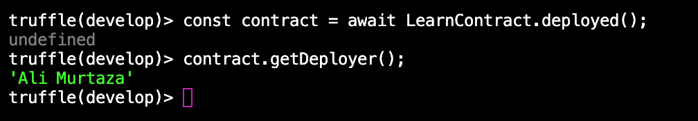
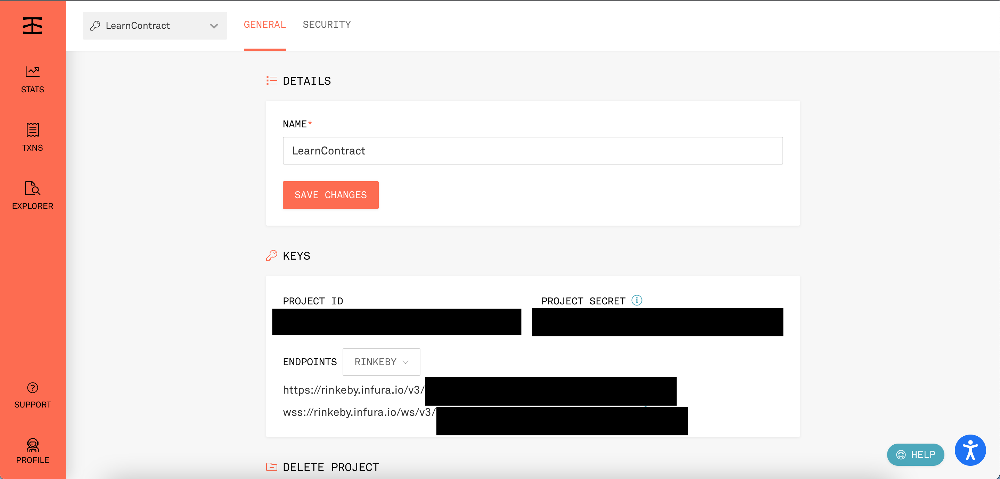
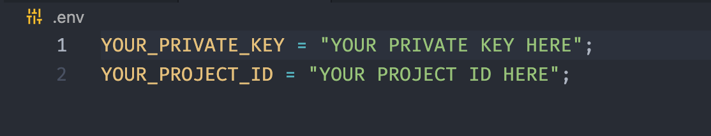
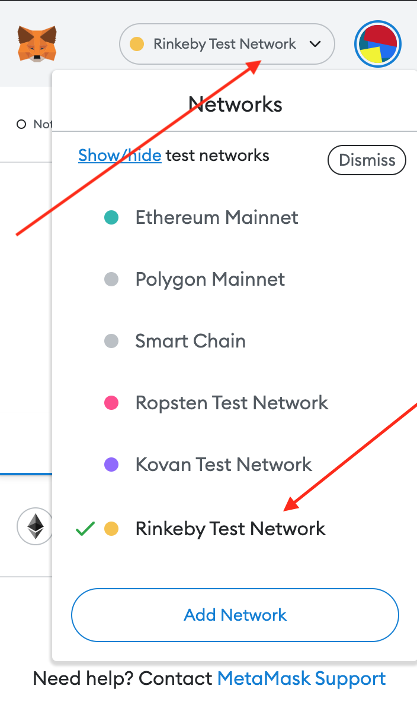
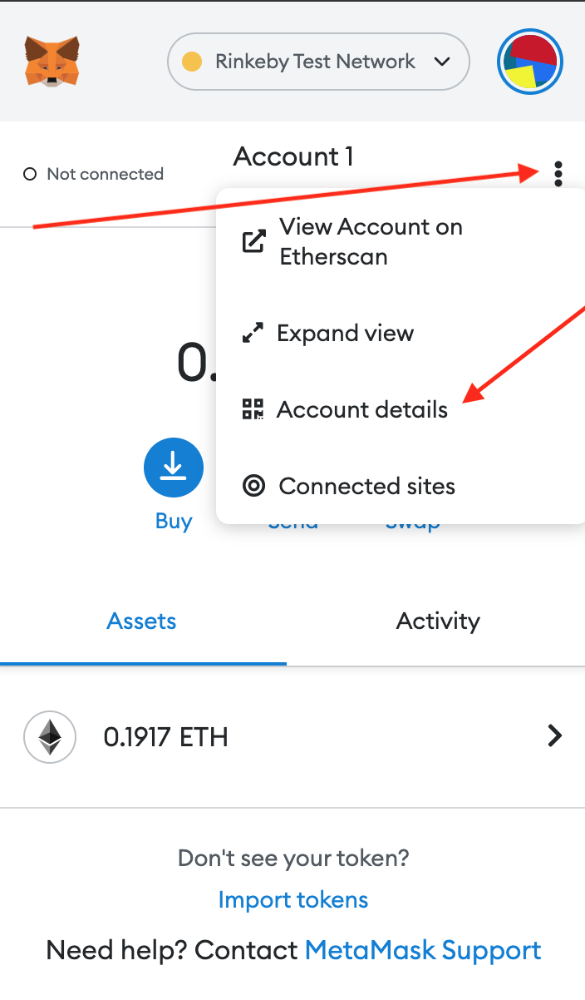
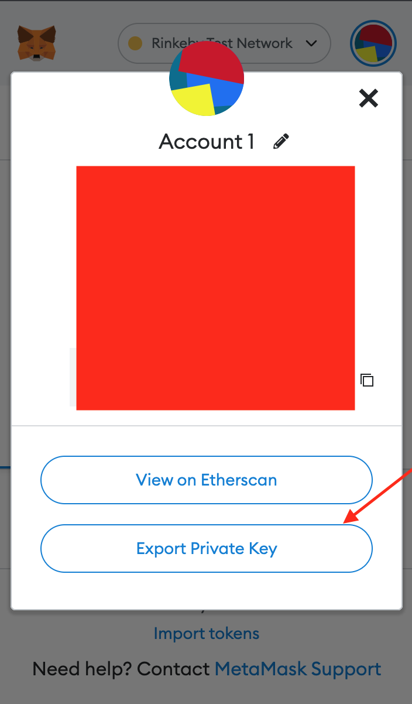

# DEPLOY YOUR FIRST SMART CONTRACT WITH TRUFFLE

As a programmer, we create many applications on a weekly or monthly basis and want to show our work to the world so they can see our potential.

Same as this when I was learning about ***Blockchain*** and ***Smart Contract Development***, I created many basic applications as a beginner and wanted to show them to others so they can interact with my developed ***DAPPS***. The guides/platforms or tutorials were very good that teach me ***how to deploy to local blockchain or public testnet***, but all were either showing using their platforms or ***Remix IDE*** and as a developer, I wanted to set up everything locally and do all things in a flow by understanding the relationship between things.

So I did that and documented this so that future beginners can understand each and everything in a flow and understand all concepts.

## Lessons Learned

You will learn to deploy the smart contract on both local blockchain and public testnet blockchain and learn/understand all the things that will be required for it. Here I will not cover the solidity, the contract will just contain an instance and a method that is very common in all programming languages, so I will only focus on deployment. 

##### Will we not learn to connect the app with the frontend? If not, then how will we interact with the smart contract?

Testing and connecting dapp with the frontend are very important parts of dapps development. but I will create a separate repo for them so you just focus on one thing at a time. And about interacting with the smart contract, I will show you how you can do that.

So, we should not take more time and start the work. Let's go!

## Prerequisites

1. Visual Code Editor [(VS code)](https://code.visualstudio.com/) (recommanded)
2. Node.js and Node Package Manager [(NPM)](https://nodejs.org/en/)
3. [Truffle](https://trufflesuite.com/)
4. Solidity Knowledge

## Get Started

Create an empty directory at your desired location

```bash
  mkdir deploy-your-first-smart-contract-with-truffle
  cd deploy-your-first-smart-contract-with-truffle/
```

## Installation

**NOTE**: Make sure that truffle is installed otherwise install it using the command.
```bash
npm install -g  truffle
```

inside the deploy-your-first-smart-contract-with-truffle directory/ run:

```bash
  truffle init
```

You will see the files and folders created by truffle something like this: you will find the same files and folders inside the starter-project folder of this repo.


**contracts:** Inside the contracts folder we create our smart contracts.   

**migrations:** migrations are javascript files that helps truffle to deploy smart contract. 

**test:** Inside test folder we create test files where we test our smart contract.   

we are just going to looking inside each by create our own from scratch.

## Create Smart Contract

Go to the contracts directory

```bash
cd constracts/
```
run

```bash
truffle create contract ContractName //set whatever the contract name you like.
```

you will see the newly created file with the name you write above inside contracts folder and when you will open it, it will look something like this.

```javascript
// SPDX-License-Identifier: MIT
pragma solidity >=0.4.22 <0.9.0;

contract LearnContract {
  constructor() public {
  }
}
```
Truffle created the smart contract with the name you write above along with the public constructor and the pragma like at the top.

Now change this file code with the below code.

```javascript
// SPDX-License-Identifier: MIT
pragma solidity >=0.4.22 <0.9.0;

contract LearnContract {
    string deployer = "Ali Murtaza"; // update to your name or anything you want.

    function getDeployer() external view returns (string memory) {
        return deployer;
    }
}
```
The contract contains state string variable and a method that return the deployer name setted above it.

make sure to change the name of contract if you wrote different and also update the deployer name.


## Compile the source code

run:

```
truffle compile
```

this command will create the build artifacts of the smart contract and put inside ./build/contracts directory.

Now we will deploy this smart contract.

**NOTE: Before deploying our smart contracts we should compile and test them and make sure that everything must work fine. I am not going to cover testing here but I have created a test for getDeployer method that you can see inside the test folder.**

## Create a Migration File

Migration files are the javascript files that help truffle to deploy the smart contracts. As we saw above when we initialize the truffle it created a **Migrations.sol** smart contract and its migration file is named **1_initial_migration.js**. This is the special contract created by truffle that keeps track of our code on-chain. It is like the history of our code changes save on-chain so that we could not ever deploy the same code again.

For deploying multiple smart contract, we need to create a separate migration file for each smart contract and give them order like at the start 1, 2, 3, etc. Migrations files will always execute in order.

1. Create a new migration file for our smart contract inside the migrations folder. You can give whatever name you like but the sequence should be followed.

```bash
cd migrations/
touch 2_learn_contract.js
```

paste the following code inside 2_learn_contract.js file:

```javascript
const LearnContract = artifacts.require("LearnContract");

module.exports = function (deployer) {
    deployer.deploy(LearnContract);
}
```
2. Initialize the artifacts of the smart contract so that we can interact with it (see on the first line).

**Note: The build artifacts are comprised of the "bytecode" versions of the smart contracts, ABIs, and some internal data Truffle is using to correctly deploy the code.**

3. Export a function that will deploy the smart contract.

Give deployer as paramter and using the method of that parameter deploy the smart contract. This object act as an interface between developer and truffle.

## Deploy to Local Blockchain

We can use the built-in local blockchain that truffle contains called **Ganache**.

**Ganache is a personal/local blockchain for rapid Ethereum and Corda distributed application development. You can use Ganache across the entire development cycle; enabling you to develop, deploy, and test your dApps in a safe and deterministic environment.**

1. Start the local blockchain, run the command.

```bash
truffle develop
```

it will also start the developer console, where you can interact with the smart contact.

2. deploy the smart contract, run the command.

```bash
migrate
```

this will check the compilation and deploy the smart contracts.

Hurry! You just deployed the smart contract on the local blockchain, isn't that simple?

3. Now to interact with the deployed smart contract with the developer console:

   i. Create the deployed contract instance.

   ```bash
   const instanceName = await ContractName.deployed();
   ```
   make sure  to replace the ContractName with you smart contract name, and you can give any instance name.

   Now we have instance of the smart contract, we can interact with it and get anything that is publically available. So let's call our deployer method.

   ii. Call our getDeployer() method so we can check either everything works fine or not.

   ```bash
   instanceName.getDeployer();
   ```
   you will see something like this.

   

   that's it you have now deployed on local blockchain and interact with it also. Now let's learn to deploy on public testnet.

   **Note: to exit from truffle developer console type .exit**

## Deploy to Public Testnet

For deploying to Testnet or mainnet, we need to configure somethings inside **truffle-config.js**.

**1. Add HD Wallet Provider.**

We are going to user Infura to deploy our code to Ethereum. This way, we can run the application without needing to set up our own Ethereum node or wallet. However, to keep things secure, Infura does not manage the private keys, which means it can't sign transactions on our behalf. Since deploying a smart contract requires Truffle to sign transactions, we are going to need a tool called **truffle-hdwallet-provider**. Its only purpose is to handle the transaction signing.

run:
```bash
npm install truffle truffle-hdwallet-provider
```

now at the top of truffle-config.js file add this:

```javascript
const HDWalletProvider = require("truffle-hdwallet-provider");
```

At this step you also create an account on [Infura](https://infura.io/) and create a project inside it.

**2. Add the network inside networks object.**

At this step, we need to add a network object where we want to deploy our smart contract, in our case it is **Rinkeby Public Testnet**. You can use any steps are same.

```javascript
rinkeby: {
      provider: () => new HDWalletProvider(mnemonic, `https://rinkeby.infura.io/v3/${process.env.YOUR_PROJECT_ID}`),
      network_id: 4,
    }
```
Add this inside networks object in truffle-config.js file. We neet add 2 things inside the object. 

  i. Provider  

  The provider will take an anonymous function that will return the provider in our case it is HDWalletProvider. The HDWalletProvider will take to arguments, 1. Mnemonic/Private key (we are going to discuss about it), 2. Endpoint of rinkeby network (you will get this from infura after creating a project, from the endpoint dropdown change that to Rinkeby). See below.

  

  ii. Network id.

  The network id of Rinkeby is 4. Change it you choose another network.

Now as you can see I have hidden the project id from the rinkeby address, and we did not define the mnemonic.

These are the secret things and we should not use them directly here publically, because in the future if you decide to upload any project to GitHub for collaboration or for any other purpose, then this can be dangerous, and more important is the mnemonic. Mnemonic is the private key of your wallet here we are using testnet wallet key but for real production projects, it will be real so adding that in this file can be very dangerous.

**So where should we store these?**

You should add that to .env file and add .env to .gitignore.

Let's do that; run:

```bash
npm install dotenv
```

now create .env file inside root folder

```bash
touch .env
```
inside the file add these



You can get the project id from the project you just create in infura and the private key from the MetaMask.

Install the MetaMask extension in your browser and if you do not have MetaMask account then create one know.


After creating account select the Rinkeby Test Network from the networks tab,as shown below.



Then tap on the 3 dots, and select Account details



Then select Export Private key, it will ask you for your MetaMask password and after that show you private key. Make sure to secure it and do not share anywhere.



Now add this key to .env file because we are going to add it inside .gitignore file.

create .gitignore file

```bash
touch .gitignore
```

add this inside .gitignore file

```javascript
# NODE MODULES
node_modules/

# COMPILED CONTRACTS FOLDER
build/

# ENVIRONMENT VARIABLES FILE
.env
```

now at the top of truffle-config.js file add this.

```javascript
const mnemonic = process.env.YOUR_PRIVATE_KEY;
```

process.env comes from dotenv package and it will read your private key from .env file and will not show publically.

do the same for rinkeby address inside HDWalletProvider.

```javascript
`https://rinkeby.infura.io/v3/${process.env.YOUR_PROJECT_ID}`
```

Configurations are complete now lets deploy.

1. Delete the build/ folder that was created when deployed to local blockchain

```bash
rm -rf build/
```

2. Then run **truffle migrate --reset --network rinkeby**, this will recompile and redeploy the smart contracts.

```bash
truffle migrate --reset --network rinkeby
```

3. Now to interact with the deployed smart contract with the developer console:

    i. Run

    ```bash
    truffle console --network rinkeby
    ```

    ii. Create the deployed contract instance.

    ```javascript
    const instanceName = await ContractName.deployed();
    ```

    iii. Using the instance communicate with the smart contracts. Lets call the getDeployer();

    ```bash
    instanceName.getDeployer();
    ```

    That's it you will see the deployer name inside the console.

    Hurry! You have just deployed to Public Testnet Network, you can deploy to any public testnet just need to update the object inside networks object in truffle-config.js file.

It was really long process, but believe me once you will understand everything after that you will do all that yourself without seeing anything like me.

Thank you for reading this and if you have any question you can follow me on these platforms and ask questions anytime.

[](https://www.linkedin.com/in/alymurtazamemon/)
[](https://twitter.com/alymurtazamemon)
[](https://github.com/alymurtazamemon)


